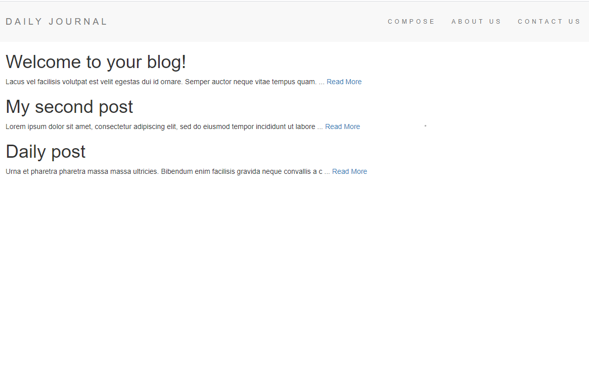

# Blog Post Website

This site, created using Express/ejs, is to make simple blog posts with a title and content.

Each post will be previewed on the home page up to 100 characters and clicking on the "Read More" link will bring you to the post's respective page. On that page will be the post's title and full content along with a delete button to delete the post. The posts are saved in a local mongoDB.
